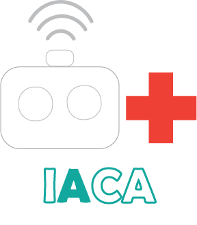

# Intelligent Antenatal Care Assistant 
### Application of Gradient Boost Regressor
Inspired by a problem that is common

Version 1.0.0

Version 1.0.1

Inline with this machine learning regression model, the following was achieved:
* Integrating ML model into a web application
* Flask was used for deployment

## Note
This is a sequel of the Birth Prediction Repository

* Major changes are to be made to improve the model's performance

This is one of the projects thought and designed based around the situation most communities in remote locations face.

Feel free to improve and contribute.